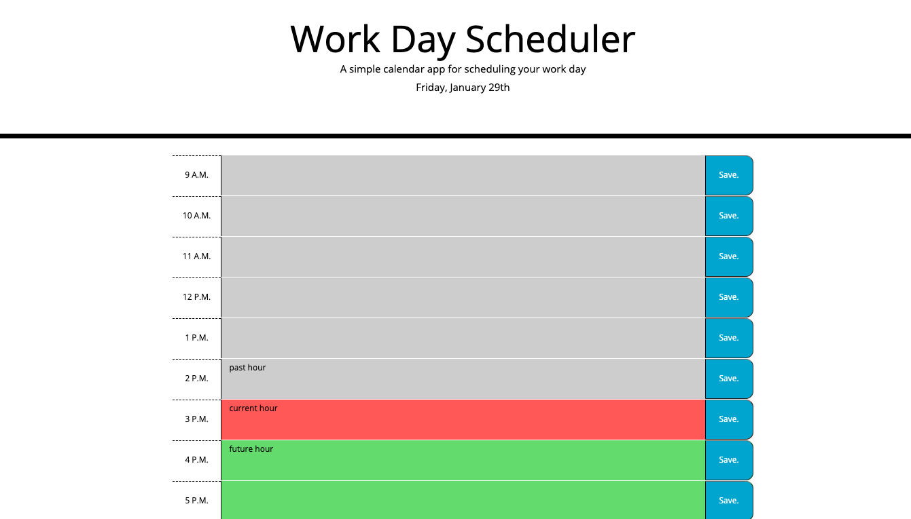
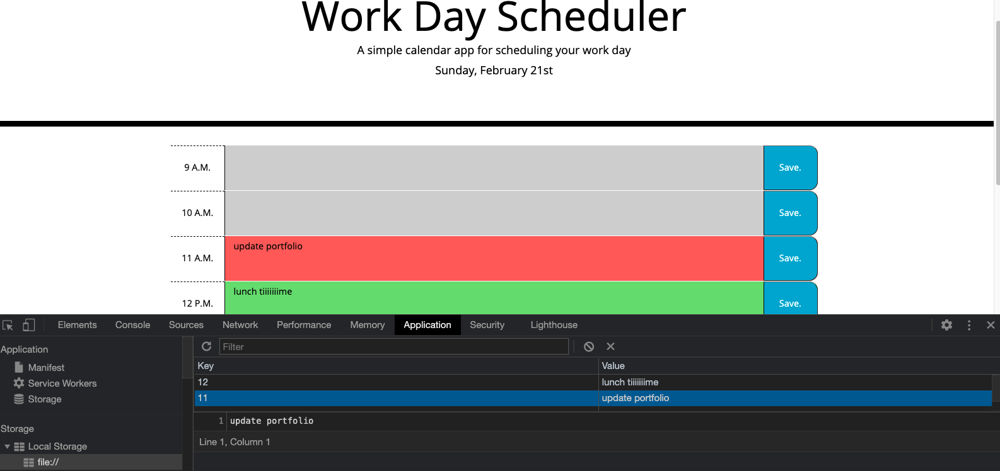

# WorkDayScheduler

## Motivation.
I wanted to test my skills at interacting with the users local storage as well as using jquery to interact with the display

## Why this project, and how to use.
I love schedules and planners. Making an interactive one sounded great.

* Click inside of the text area that corresponds with the hour you need to schedule something.
* Type in your event
* click the save button
* the text area will turn red to represent the hour block of the day the user is currently in.
* the text area will turn grey when that block is in the past.
* all green time blocks represent future appointment times.

* see screenshot of the application below for example.

once saved you can close the window and then reopen, or refresh your browser, and you will see your schedule still reads true. 

## What problem are we solving?
You can provide this link to your whole team at the office, and they can all use the link on their individual cell phones or computers to set their days.

## What I learned.
I learned how to better manipulate loops on a higher level, how to utilize the users local storage,  and how to dictate interaction between jquery, javascript, html, css, and local storage to work together.

## Deployed application

https://iigonzoii.github.io/WorkDayScheduler/
